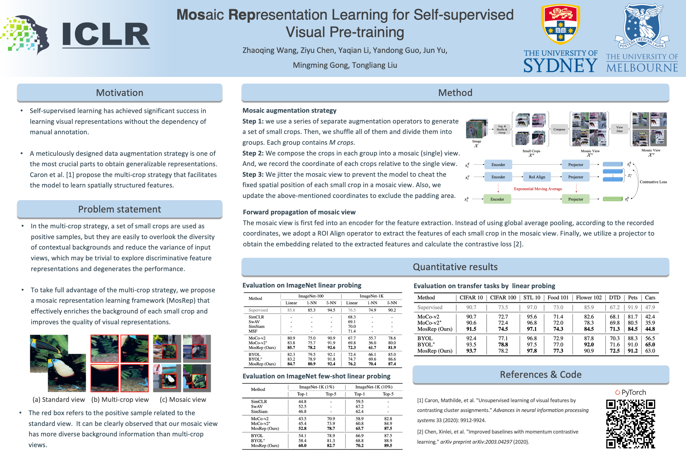

## [ICLR 2023 Spotlight] Mosaic Representation Learning for Self-supervised Visual Pre-training


<p align="center">
  
</p>

This is a PyTorch implementation of [our paper.](https://openreview.net/pdf?id=JAezPMehaUu)
```
@inproceedings{wang2023mosaic,
  title={Mosaic Representation Learning for Self-supervised Visual Pre-training},
  author={Wang, Zhaoqing and Chen, Ziyu and Li, Yaqian and Guo, Yandong and Yu, Jun and Gong, Mingming and Liu, Tongliang},
  booktitle={The Eleventh International Conference on Learning Representations},
  year={2023}
}
```


### Requirements

- Python >= 3.7.12
- PyTorch >= 1.10.2
- torchvision >= 0.11.3

Install PyTorch and ImageNet dataset following the [official PyTorch ImageNet training code](https://github.com/pytorch/examples/tree/master/imagenet).

For other dependencies, please run:
```
pip install -r requirements.txt
```

### Webdataset

We use webdataset to speed up our training process.
To convert the ImageNet dataset into webdataset format, please run:
```
python imagenet2wds.py -i $IMAGENET_DIR -o $OUTPUT_FOLDER
```


### Unsupervised Pre-training

This implementation only supports **multi-gpu**, **DistributedDataParallel** training, which is faster and simpler; single-gpu or DataParallel training is not supported.

To do unsupervised pre-training of a ResNet-50 model on ImageNet in an 8-gpu machine, please run:
```
# MoCo-v2
bash pretrain_moco.sh

# MosRep
bash pretrain_mosrep.sh
```

### Linear Classification

With a pre-trained model, to train a supervised linear classifier on frozen features/weights in an 8-gpu machine, please run:
```
# MoCo-v2
bash linear_moco.sh

# MosRep
bash linear_mosrep.sh
```

### Models

Our pre-trained ResNet-50 models can be downloaded as following:
<table><tbody>
<!-- START TABLE -->
<!-- TABLE HEADER -->
<th valign="bottom">Method</th>
<th valign="bottom">Input view</th>
<th valign="bottom">Epochs</th>
<th valign="bottom">Linear Probing Top-1 acc.</th>
<th valign="bottom">Model</th>
<!-- TABLE BODY -->
</tr>
<tr><td align="left"><a href="https://arxiv.org/abs/2003.04297">MoCo v2</a></td>
<td align="center">2x224 </td>
<td align="center">200</td>
<td align="center">67.7</td>
<td align="center"><a href="https://drive.google.com/file/d/1Nes3dxDvo0vmQ5uBuIuTJPfG1aX0kwan/view?usp=share_link">download</a></td>
</tr>

</tr>
<tr><td align="left"><a href="https://arxiv.org/abs/2003.04297">MoCo v2</a></td>
<td align="center">2x224 + 4x112 </td>
<td align="center">200</td>
<td align="center">69.8</td>
<td align="center"><a href="https://drive.google.com/file/d/1FhVT71MlNj0e2WCiYfzBeqSYecMwedTj/view?usp=share_link">download</a></td>
</tr>

</tr>
<tr><td align="left"><a href="https://openreview.net/pdf?id=JAezPMehaUu">MosRep</a></td>
<td align="center">2x224 + 4x112 </td>
<td align="center">200</td>
<td align="center">72.3</td>
<td align="center"><a href="https://drive.google.com/file/d/1Gs0qL5eUgOb-BhLIHd4Q50mMTKNjlo32/view?usp=share_link">download</a></td>
</tr>

</tbody></table>


### License
This project is under the MIT license. See the [LICENSE](LICENSE) file for more details.